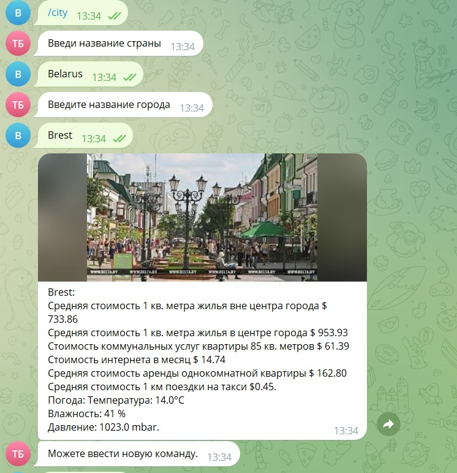
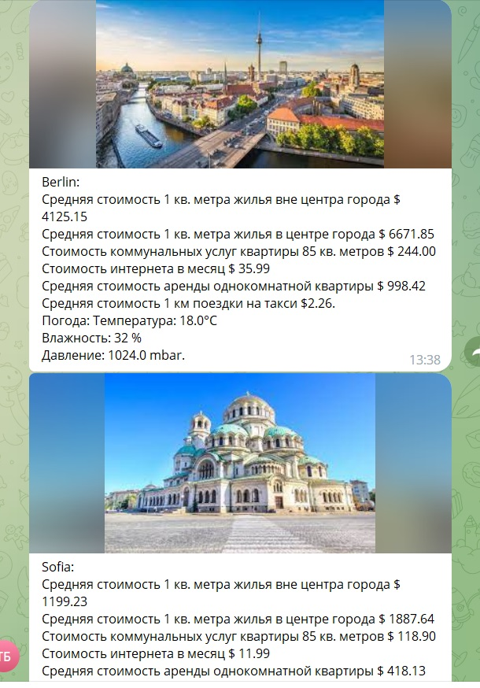

<!DOCTYPE html>
<html lang="ru">
<head>
  <meta charset="UTF-8">
  <meta http-equiv="X-UA-Compatible" content="IE=edge">
  <meta name="viewport" content="width=device-width, initial-scale=1.0">
  <title>Readme.md</title>
  <link rel="stylesheet" href="CSS/style.css">
  <link rel="stylesheet" href="CSS/normalize.css">
</head>
<body>
  

    <h1 class="title">
      Телеграмм бот 
    </h1>
    

        Данный телеграмм бот выводит информацию о городах введенных пользователем стран.
    

    <h2>
        Список команд телеграмм бота:
    </h2>
        <ul>
        <li><a href="#p1">/country</a></li>
        <li><a href="#p2">/city</a></li>
        <li><a href="#p3">/compression</a></li>
        <li><a href="#p4">/history</a></li>
        <li><a href="#p5">/help</a></li>
        </ul>
    <h3 id="p1"> Команда /country</h3>
        
 После ввода запрашивает ввести название страны и выводит список всех имеющихся в базе городов

    <h3 id="p2"> Команда /city</h3>
        
 После ввода запрашивает ввести название страны и города выводит иформацию о городе

        
    <h3 id="p3"> Команда /compression</h3>
        
 После ввода запрашивает ввести по очереди для двух городов название страны и города, после выводит иформацию о городах

            
    <h3 id="p4"> Команда /history</h3>
        
 После ввода выводит информацию о последних 10 запросов

    <h3 id="p5"> Команда help</h3>
        
 После ввода выводит список команд телеграмм бота

<h2 class="title">
        Установка и запуск
    </h2>
    

        Скопируйте с репозитория в выбранную директорию и запустите скрипт main.py
    

  

</body>
